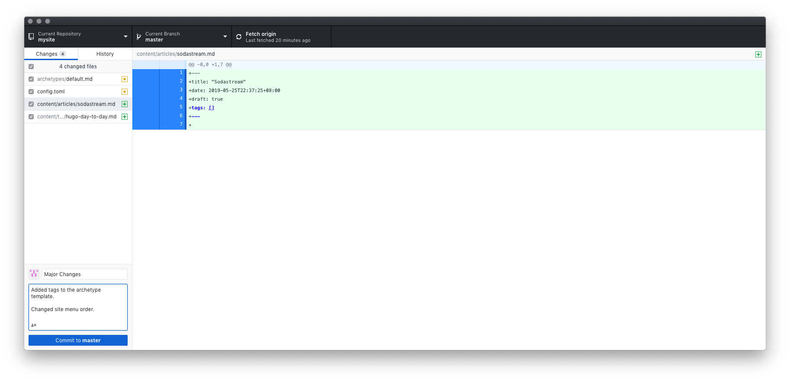

Managing the blog is done via Terminal. These are the key commands I've encountered so far.

<!--more-->

## Adding links to your site menu

Open your `config.toml` file and add in:

```toml
[menu]
  [[menu.main]]
    name = "About"
    url  = "about"
    pre = "<i class='fa fa-heart'></i>"
    weight = 1

  [[menu.main]]
    name = "Articles"
    url  = "articles/"
    weight = 10

  [[menu.main]]
    name = "Blog"
    url  = "blog/"
    weight = 20

  [[menu.main]]
    name = "Home"
    url  = "/"
    weight = 30

  [[menu.main]]
    name = "Tutorials"
    url  = "tutorials/"
    weight = 100
```

Note that this is dependent on your theme. In Cactus Plus this doesn't work (because the template isn't set up as such). However for my previous theme that I used, Paper, it did work.

## Creating a new post

Whenever I want to create a new post, I change my current working directory to the local project, then create a new post via:

```bash
cd my_blog

hugo new posts/new-post.md
```

Note that `draft` is set to `false` by default for the posts. Hugo will not publish these. More info [here](https://gohugo.io/getting-started/usage/).

### Adding images to your post

Put them in the `static` folder. Recommended set up is within `static/img` and subdirectories with names identical to post slugs i.e.:

```
/content/future-of-bali.md
/static/img/future-of-bali/green-school-power-plant.jpg
```

### Adding article description/summary

Specific to my Cactus Plus theme, if I wish to add a post summary:

> To use the content summary, you may add the `<!--more-->` summary divider where you want to split the article alternatively. For org content, use `#` more where you want to split the article. Content that comes before the summary divider will be used as that content’s summary.By default, Hugo automatically takes the first 70 words of your content as its summary.

### Building the website (and therefore post)

Once your article is ready, you will need to `build` the files. This creates the `public` subfolder, which is basically the complete website and is what you deploy.

You build via running `hugo` in terminal i.e.:

```bash
hugo
```

### Commit and push

Once it's been built, next step is to use Git to commit to the repository. For this I prefer using Github Desktop. 

## Changing your blog's theme

Add it to your `themes` folder via:

```bash
cd themes
git submodule add https://github.com/nodejh/hugo-theme-cactus-plus.git
```

Then open your `config.toml` file and make sure the `theme` name is exactly the same as the folder name in the `themes` directory.

\*For my switch to Cactus Plus, I had to change the `default.md` archetype too. Make sure to revert if I switch themes again.
