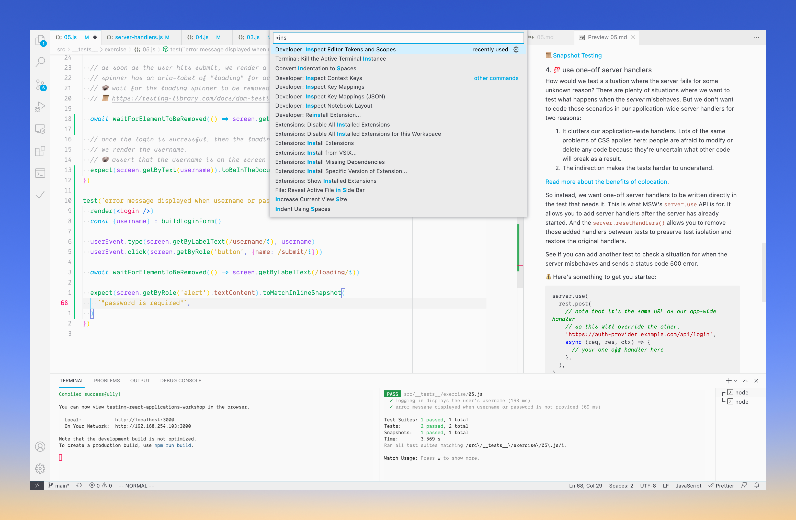
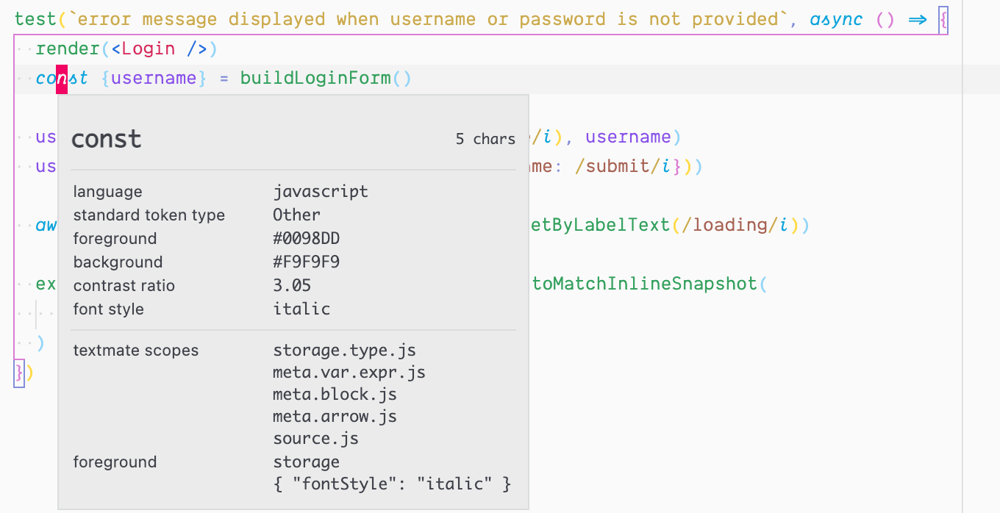
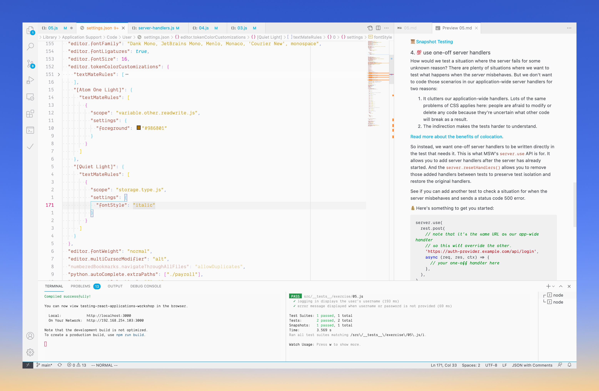

In VSCode, open command palette and search for "Inspect Editor Tokens and Scopes". This will allow you to identify which scopes you want to modify.

For example, I want to modify the `const` keyword. 

I now know that one way to modify it is to use its scope `storage.type.js`. So go to your *settings.json*,  then under `"editor.tokenColorCustomizations"`, add it in. In my case, I want it modifed on a per theme basis, so I create an object for that theme.

---
Related: 